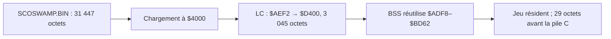

# Audit du code et de la mémoire de SCOSWAMP

**État historique ci-dessous.** Les mesures plus récentes du chargement LC
sont dans [MEMOIRE-LC-STAGE.json](MEMOIRE-LC-STAGE.json) : 3 000 octets de
marge de chargement et 2 260 octets de tas. Le [profil des piles V2](PROFIL-PILES-V2/README.md)
mesure un pic C de 82 octets sur cinq scénarios en POM2 headless avec
Mockingboard. Ces preuves remplacent respectivement les 29 octets et
l'absence de mesure dynamique rapportés dans l'état initial de cet audit.
Après ajout de la règle de magie `MM`, les valeurs courantes deviennent
2 912 octets au chargement et 2 171 octets de tas
([MEMOIRE-MM.json](MEMOIRE-MM.json)).
Après le correctif de retour au Maître des Araignées (`VR`), la mesure la
plus récente est **2 808 octets au chargement et 2 067 octets de tas**
([MEMOIRE-VR.json](MEMOIRE-VR.json)).
La mutualisation suivante de `V`/`VR` récupère 64 octets : valeurs courantes
**2 872 octets au chargement et 2 131 octets de tas**
([MEMOIRE-REVISITES-PARTAGEES.json](MEMOIRE-REVISITES-PARTAGEES.json)).

Mesure du **6 septembre 2026**, après correction du sac en combat et
réduction des deux tableaux de pierres à 8 bits. Cible : Apple IIe Enhanced,
cc65, ProDOS 8. Ce document décrit le moteur natif C/assembleur ; l'interpréteur
JavaScript de l'atelier est un autre programme.

**Le jeu tient, mais la fenêtre principale ne garde que 29 octets libres
avant la pile C.** Les gains importants demandent désormais de travailler
sur la durée de vie des données et l'organisation du programme. Les petits
changements de compilation ne constituent pas une réserve de plusieurs Ko.

## 1. Méthode et sources des chiffres

- [Configuration du lieur](../SCOSWAMP/SRC/scoswamp.cfg), options réellement
  passées par le [Makefile](../SCOSWAMP/SRC/Makefile).
- `build.map` : tailles et adresses finales des segments, contribution de
  chaque objet, y compris les membres réellement extraits de `apple2enh.lib`.
- Listings **assemblés par ca65** : tailles des procédures et des réservations
  `.res`, y compris les variables locales rendues statiques par `-Cl`.
- [Inventaire JSON complet](MEMOIRE-SCOSWAMP.json) : **161 procédures et
  251 réservations**, adresses, tailles, appels directs et symboles exportés.
- [Expériences de compilation](MEMOIRE-EXPERIENCES.json) : variantes compilées
  en fichiers temporaires, sans remplacer le jeu en cours de test.

Les adresses de fin des tableaux ci-dessous sont **inclusives**. Dans le
JSON, `end_exclusive` est explicitement la première adresse après la zone.
Le script vérifie les sommes par segment et la taille du fichier. Les tables
fabriquées par le lieur sont distinguées des objets : 14 octets de
constructeurs, 6 de destructeurs et 2 d'interruptions.

L'installation est rangée sous `cc65/2.19`, mais l'exécutable et les listings
se présentent comme **V2.18 - N/A**. Les expériences utilisent cet exécutable
réel, pas une hypothèse sur les performances d'une autre version.

## 2. Fichier chargé et mémoire résidente : deux comptes différents

`SCOSWAMP.BIN` fait **31 447 octets**, sans en-tête AppleSingle. Il est chargé
à `$4000`, donc son dernier octet arrive à **`$BAD6`**.

| Élément chargé | Début de chargement | Taille |
| --- | --- | ---: |
| STARTUP + LOWCODE + CODE + RODATA + DATA + INIT | `$4000` | 28 152 |
| ONCE, initialisation et constructeurs | `$ADF8` | 250 |
| Image initiale de LC, à reloger en `$D400` | `$AEF2` | 3 045 |
| **Fichier total** | | **31 447** |

À l'exécution, la LC se trouve ailleurs et ONCE n'a plus à être conservé.
La BSS principale réutilise leur emplacement de chargement à partir de
`$ADF8`. **Additionner le fichier entier à toute la BSS compterait deux fois
une partie de la RAM.** Inversement, ne mesurer que le fichier ignore les
variables sans octets dans le fichier.



L'empreinte de la fenêtre principale est :

`$BD63 − $4000 = 32 099 octets`, sur **32 128 disponibles** avant la pile.

La somme des segments résidents du lien, en comptant leurs banques et en
excluant ONCE, est **40 241 octets**. Ce total n'inclut pas les écrans, le
tampon ProDOS, les piles ni les zones du système. Ce n'est donc pas la
consommation totale de la machine.

## 3. Carte mémoire exacte du lien final

| Segment / réserve | Adresses inclusives | Octets | Nature |
| --- | --- | ---: | --- |
| ZEROPAGE | `$0080–$0099` | 26 | Registres logiciels cc65 |
| MAPBSS | `$0C00–$0FF3` | 1 012 | Carte et variables déportées |
| Libre dans MAPRAM | `$0FF4–$0FFF` | **12** | Disponible dans cette zone |
| LOWBSS | `$1000–$1FDA` | 4 059 | État, texte, messages, buffers |
| Libre dans LOWRAM | `$1FDB–$1FFF` | **37** | Disponible dans cette zone |
| STARTUP | `$4000–$4033` | 52 | Entrée du runtime |
| LOWCODE | `$4034–$408E` | 91 | Runtime cc65 |
| CODE | `$408F–$A53F` | 25 777 | Section de code principale |
| RODATA | `$A540–$ACD0` | 1 937 | Constantes et tables |
| DATA | `$ACD1–$AD99` | 201 | Données initialisées |
| INIT | `$AD9A–$ADF7` | 94 | Données d'initialisation du runtime |
| BSS | `$ADF8–$BD62` | 3 947 | Variables principales |
| Intervalle libre / tas | `$BD63–$BD7F` | **29** | Marge avant la pile |
| Pile logicielle C réservée | `$BD80–$BEFF` | **384** | Descend depuis le haut de la RAM du programme |
| LC, banque 2 | `$D400–$DFE4` | 3 045 | 2 937 octets de procédures + 108 de tables |
| Libre dans la zone LC du jeu | `$DFE5–$DFFF` | **27** | Disponible en banque 2 |

Les quatre marges représentent **105 octets répartis**. Ce ne sont pas
105 octets contigus utilisables par le tas ni par n'importe quelle fonction.
Une fonction de 200 octets ne peut entrer dans aucune de ces marges sans
autre déplacement ou réduction.

### Autres zones à ne pas oublier

| Zone | Utilisation |
| --- | --- |
| `$0100–$01FF` | Pile matérielle 6502 : retours, interruptions, registres sauvegardés |
| `$0200–$03FF` | Zone système/firmware ; non déclarée libre par le lien du jeu |
| MAIN et AUX `$0400–$07FF` | Écran texte 80 colonnes : deux banques de 1 Ko |
| MAIN `$0800–$0BFF` | Tampon ProDOS aligné de **1 Ko**, fourni par `apple2enh-iobuf-0800.o` |
| MAIN et AUX `$2000–$3FFF` | Image DHGR : **8 Ko par banque**, soit **16 Ko** |
| `$BF00–$BFFF` | Page globale ProDOS, hors RAM disponible pour le jeu |
| `$C000–$CFFF` | Commutateurs matériels et ROM des cartes dans l'espace d'adressage |
| LC hors `$D400–$DFFF` | Non attribuée au jeu par cette configuration : runtime de sortie / système |
| `$FA–$FF` en page zéro | Six octets de travail du pilote Mockingboard sous le contrat d'IRQ ProDOS |

Le lanceur `.SYSTEM`, chargé initialement à `$2000`, ne doit pas être
compté comme une allocation permanente supplémentaire : cette zone devient
ensuite la page graphique.

Les autres adresses AUX ne sont pas allouées par ce lieur. Cela donne des
**candidates pour une extension**, pas la preuve que « 47 Ko sont libres »
dans tous les environnements ProDOS. Il faut établir la réservation des
banques et les interactions avec le système avant d'y placer des données.

## 4. Qui consomme les octets ?

### Par module

`RAM` ci-dessous additionne BSS, LOWBSS et MAPBSS ; DATA reste séparée.
Les 108 octets de tables de `rules.o` restent dans la colonne LC.

| Objet | CODE | LC | RODATA | DATA | RAM non initialisée |
| --- | ---: | ---: | ---: | ---: | ---: |
| scoswamp.o | **15 613** | **2 235** | 772 | 2 | **3 203** |
| rules.o | 3 553 | 810 | 789 | 0 | 272 |
| paths.o | 251 | 0 | 5 | 0 | 2 |
| memory_swap.o | 100 | 0 | 0 | 1 | 0 |
| dice.o | 251 | 0 | 0 | 4 | 3 |
| messages.o | 529 | 0 | 24 | 0 | **1 756** |
| hgr_loader.o | 373 | 0 | 11 | 0 | 138 |
| sfx.o | 194 | 0 | 0 | 0 | 3 |
| music.o | 986 | 0 | 132 | 0 | **3 614** |
| iobuf-0800.o | 54 | 0 | 0 | 8 | 0 |
| Bibliothèque cc65, objets effectivement liés | **3 873** | 0 | 196 | 186 | 27 |

À cette table s'ajoutent STARTUP 52, LOWCODE 91, INIT 94, ONCE 250 et les
8 octets de tables de lieur en RODATA. Le tampon ProDOS de 1 Ko est une
réserve à adresse fixe, pas une `.res` de l'objet iobuf.

La bibliothèque n'est pas un bloc opaque chargé en entier. Les plus gros
membres liés comprennent `open.o` (267 octets tous segments), `fread.o`
(214), `fgets.o` (170), `atoi.o` (145), `ctype.o` (139) et `fgetc.o` (132).
Retirer une fonction C du source ne retire son membre de bibliothèque que
si aucun autre appel n'en a encore besoin.

### Fonctions les plus volumineuses

| Fonction | Zone | Octets assemblés | Début |
| --- | --- | ---: | --- |
| classify_line | CODE | **3 090** | `$5946` |
| run_combat | CODE | **1 368** | `$7375` |
| show_map | CODE | **1 335** | `$6DDC` |
| show_inventory | CODE | **771** | `$6AD9` |
| cfmt | CODE | **608** | `$4C05` |
| load_scene | CODE | 556 | `$4117` |
| handle_user_input | CODE | 540 | `$7AA9` |
| parse_text_file | CODE | 537 | `$6558` |
| messages_load | CODE | 466 | `$8DC7` |
| choose_stones | LC | 362 | `$DA10` |
| map_load | CODE | 353 | `$5307` |
| choice_available | CODE | 339 | `$5022` |
| show_saves | CODE | 321 | `$4343` |
| map_voisin | LC | 302 | `$D566` |

Les cinq premières représentent **7 172 octets**, soit environ **27,8 %**
de CODE. Ce sont des tailles, pas un profil de temps CPU : une grande
fonction exécutée une fois par page n'est pas nécessairement lente en jeu.

### Les allocations déterminantes

| Allocation | Octets | Adresses |
| --- | ---: | --- |
| music_buf | **3 584** | `$AF2A–$BD29` |
| Catalogue de messages `pool` | **1 631** | `$188C–$1EEA` |
| file_buffer | **1 280** | `$10EE–$15ED` |
| map_data | 884 | `$0C00–$0F73` |
| AppState | 238 | `$1000–$10ED` |
| map_pages | 230 | `$1683–$1768` |
| Mémoire des adversaires `seen` | 160 | `$17EC–$188B` |
| Bloc d'entrée du décodeur graphique | 128 | `$1F5B–$1FDA` |
| Pointeurs du catalogue `slot` | 112 | `$1EEB–$1F5A` |
| title_bar | 81 | `$1632–$1682` |
| Bitmap des pages visitées | 53 | `$0FBF–$0FF3` |
| Pointeurs des 18 lignes du récit | 36 | `$15EE–$1611` |
| Clairières connues `map_vu` | 35 | `$1769–$178B` |
| Pierres du sac `shown` | **12** | `$17D9–$17E4` |
| Pierres proposées `allowed` | **12** | `$0FAD–$0FB8` |

`music_buf` représente à lui seul **90,8 % de la BSS principale**. Ses deux
parties sont 2 304 octets pour la zone et 1 280 pour la surcouche. Cela permet
de revenir au thème précédent sans le relire et en conservant son curseur.

Le fichier texte courant reste en mémoire : les titres et choix pointent
dedans. **Choice fait 8 octets**, pas les 77 évoqués par un ancien commentaire.
Les cinq choix occupent donc 40 octets au sein d'AppState. Le tampon de
sauvegarde réutilise déjà `file_buffer` : il n'existe pas un second buffer de
sauvegarde de 1 280 octets à supprimer.

Mesure du corpus actuel : **420 pages FR et 420 EN**. La plus longue page FR
fait **1 270 octets**, contre 1 117 en EN. Réduire `file_buffer` à 1 024
tronquerait donc des pages. Avec le NUL final, on ne peut récupérer que
**9 octets** en serrant ce buffer au plus juste, sans marge d'évolution.

MSGFR fait 1 599 octets, MSGEN 1 362. Réduire `pool` de 1 631 à 1 600 ne
rendrait que **31 octets de LOWRAM**, en consommant sa réserve pour les
traductions. Ce n'est pas un gain de 1,6 Ko.

## 5. Structure du code, contraintes et améliorations

La séparation existante est utile : `rules.c` calcule les règles,
`hgr_loader.s` décode l'image par blocs de 128 octets, `music.s` gère l'IRQ,
`messages.c` charge une langue. Le point de concentration est `scoswamp.c` :
parsing, transitions de scènes, affichage, carte, sac, sauvegardes et combats.

Les améliorations prioritaires sont les suivantes :

1. **Séparer observation, rendu et mutation du combat.** Le défaut du sac
   provenait d'un verrou d'interface plus large que la règle sur les pierres.
   Le correctif conserve le `Round`, la blessure en attente et le numéro
   d'assaut, puis repeint sans relancer les dés. Les tests comparent maintenant
   la suite au même combat sans consultation du sac.
2. **Centraliser le contrat de rendu 80 colonnes / DHGR.** Écrire le texte en
   mode graphique plein sans rétablir 80STORE altère une banque sur deux.
   Le correctif gère ce cas dans le combat ; cette condition matérielle doit
   être explicite pour tous les écrans modaux, plutôt que supposée par leurs
   appelants. Éviter une grosse abstraction non mesurée qui gonflerait chaque
   appel sur 6502.
3. **Distinguer commande narrative et effet moteur.** `classify_line` mélange
   conversion des arguments, mutations, conditions et création des choix.
   Une table de commandes avec contrat d'arguments et tests de contenu rendrait
   visibles les scènes qui promettent un soin sans l'appliquer ou proposent
   un succès sans vérifier sa condition. Le générateur peut vérifier ces
   contrats sans consommer de RAM dans le jeu.
4. **Formaliser la durée de vie des buffers.** Les pointeurs de choix et de
   récit interdisent d'écraser `file_buffer` avant leur dernier usage ; les
   deux musiques sont volontairement conservées ; les buffers des menus ne
   sont pas tous vivants ensemble. Dessiner ces durées de vie avant de créer
   des unions de mémoire évite un gain qui corrompt une autre page.
5. **Continuer à mesurer le résultat lié.** Une fonction extraite ou un enum
   mieux nommé peut améliorer la lecture tout en ajoutant des appels et des
   promotions 16 bits. Chaque refactorisation doit avoir un delta CODE, LC,
   BSS et un scénario de comportement associé.

Le jeu n'ouvre qu'un fichier ProDOS à la fois. Un second fichier avec ce
pilote prendrait le bloc `$0C00–$0FFF`, désormais occupé par MAPBSS. Ni le
chargement d'un autre catalogue en parallèle ni un streaming musical via un
second `fopen` ne peuvent être ajoutés sans revoir cette allocation.

### Piles, locales statiques et IRQ

La pile logicielle C réservée est **384 octets** ; la pile matérielle 6502
est une autre zone de 256 octets. **Le pic réel de consommation de ces piles
n'a pas été mesuré par cet audit.** Il ne faut pas transformer la réserve
connue en une affirmation de marge disponible sur la pile.

`-Cl` transforme les locales en stockage permanent et interdit la réentrance.
Le graphe des appels C directs extrait des procédures ne présente **aucun
cycle** dans les modules inspectés. Ce contrôle ne prouve pas l'absence de
réentrance par interruption ou appel indirect, et ne calcule pas la pile
maximale de la bibliothèque.

La Mockingboard travaille sous IRQ à 50 Hz. Son code demeure dans CODE :
ProDOS peut commuter la Language Card. Déplacer son lecteur en LC pour
« gagner de la place » dans MAIN romprait ce contrat. Déporter le flux en AUX
nécessite un accès sûr sous IRQ, pas seulement un autre `#pragma`.

## 6. Optimisations mesurées et choix retenus

### Livrées

- **Tableaux de pierres sur 8 bits** : `shown` et `allowed` stockent des
  indices 0..11, pas des valeurs qui ont besoin d'un enum 16 bits. Gain :
  **24 octets de CODE, 24 de LC, 12 de LOWBSS et 12 de MAPBSS**. Le fichier
  passe de 31 495 à **31 447 octets**. Les marges passent respectivement de
  **5/3/25/0 à 29/27/37/12** octets (MAIN/LC/LOWRAM/MAPRAM).
- **Contrôle mémoire inclusif corrigé** : l'ancien script plaçait le tas sur
  le dernier octet de BSS. Il surestimait la marge d'un octet et acceptait
  le premier octet de débordement dans la pile. Il calcule maintenant
  `BSS.Start + BSS.Size`. Trois tests de frontière protègent ce calcul.
- **Commentaires périmés corrigés** : taille des choix, page texte maximale,
  taille du catalogue, réserve de pile et référence courante dans le TODO.

Les menus et le sac passent **80 assertions sur sept scénarios** après
réduction des tableaux ; le correctif du sac avant cette réduction avait
passé **86 assertions sur six scénarios**. Les ensembles se recouvrent : il
ne faut pas annoncer 166 vérifications indépendantes. Les parcours complets
archivés antérieurement portent un autre SHA-256 et ne sont pas présentés
comme une nouvelle validation de bout en bout de ce binaire.

### Expériences isolées sur scoswamp.o

Deltas par rapport à la version finale à tableaux 8 bits :

| Variante | Δ CODE | Δ LC | Δ BSS | Δ LOWBSS | Δ MAPBSS | Conclusion |
| --- | ---: | ---: | ---: | ---: | ---: | --- |
| `--codesize 120` | 0 | 0 | 0 | 0 | 0 | Aucun gain |
| `--codesize 150` | +6 | 0 | 0 | 0 | 0 | Grossit légèrement |
| `--codesize 200` | +940 | +58 | 0 | 0 | 0 | Ne tient plus |
| Retrait global de `-Cl` pour ce module | +54 | −9 | −205 | −96 | −75 | Gain statique, report vers la pile à mesurer |

Retirer `-Cl` rendrait **151 octets nets à MAIN** dans ce module : 205 de
BSS libérés moins 54 de code ajoutés. Cela libérerait aussi 96 en LOWRAM,
75 en MAPRAM et 9 en LC. **Ce résultat n'est pas livré** : les tableaux et
locales changent de durée de vie et consomment alors la pile de 384 octets.
Il faut mesurer le maximum avant d'appliquer ce drapeau globalement.

Les anciens gains de centaines d'octets attribués à `-Cl` dans les commentaires
étaient des mesures d'une autre version ; ils ne suffisent plus pour décider.

## 7. Réserves de progrès, chiffrées sans promettre un gain fictif

| Piste | Gisement mesuré | Travail et limite |
| --- | --- | --- |
| Locales temporaires sur pile, choisies fonction par fonction | L'expérience globale expose 376 octets de locales statiques | Mesurer le pic de pile ; conserver statiques les grands buffers et les chemins profonds |
| Workspace partagé pour menus exclusifs | Buffers de titres 40 et 32 octets, tableau de choix de pierres 12 | Prouver les durées de vie et les imbrications ; gain inférieur à la somme brute après comptabilité |
| Musique en AUX ou lecteur à petite fenêtre | **3 584 octets**, le premier gisement de MAIN | Adapter le lecteur IRQ et la conservation des curseurs ; coût du staging et de la commutation à soustraire |
| Commandes de scène préparées lors du build | classify_line 3 090 + parse_text_file 537 octets | Le dispatch des effets reste nécessaire ; ces 3 627 octets ne sont pas tous supprimables |
| Catalogue d'interface partiellement chargé ou compressé | pool 1 631 + pointeurs 112 en LOWRAM | Affichage et combat demandent souvent les mêmes messages ; prévoir cache, décodage et coût des lectures |
| Overlay de menus rarement utilisés | show_map 1 335, show_saves 321, show_help 262, show_inventory 771 | Les menus se superposent au combat ; zone d'overlay distincte, chargeur et retours sûrs indispensables |

Ordre conseillé : **mesure de pile → locales ciblées / workspace → accès AUX
pour données musicales → éventuels formats compilés ou overlays**. Les deux
premières étapes peuvent rendre quelques centaines d'octets ; les suivantes
visent les Ko. Ne pas réduire la pile ou réutiliser un écran comme tampon
permanent pour fabriquer artificiellement une marge.

## 8. Reproduire et garder les chiffres à jour

```sh
make -C SCOSWAMP/SRC hdv
python3 SCOSWAMP.MORE/TOOLS/audit_memory.py --output DOCS/MEMOIRE-SCOSWAMP.json --experiments DOCS/MEMOIRE-EXPERIENCES.json
python3 tools/test_check_memory.py
python3 -u SCOSWAMP.MORE/TOOLS/playtest.py --only sac_combat --only mort_dans_sac --only sac_douze --only blessures_apres_soin --only gayolard --only pompatarte --only stratagus --port 6525
```

Le script d'audit ne relie pas de variante dans le disque de travail : il
assemble les listings et compile les expériences dans un dossier temporaire.
Les JSON conservent les tailles détaillées et les empreintes. Après une
modification, régénérer les mesures avant de recopier des adresses dans un
guide ou un test.

SHA-256 de `SCOSWAMP.BIN` audité :

`5a2ea2deaeac45f5a7677c91009f1e7b70c94de4295759a603f6c647779e3583`
